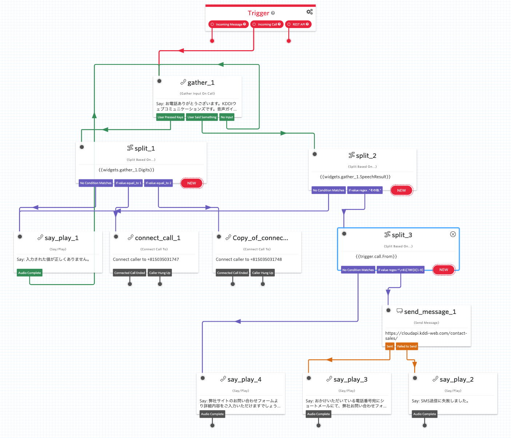

# 営業デモ（IVR）

Twilio Functionsを使ったIVRのサンプルプログラムです。
Twilio CLI Serverlessで実装してあります。

## 機能

このプログラムをTwilio Studioで実装すると、以下のようなフローとなります。  

050番号に着信すると、`ivr.js`が呼び出され、ガイダンスが流しながら、DTMF信号もしくは音声発話を受け付けます。  
DTMFもしくは音声発話がされると、その内容が`action.js`に渡されます。  
DTMF信号が１だった場合、`.env`に指定した`SALES_NUMBER`に転送されます。転送先の番号で`guide.js`が呼び出されます。  
DTMF信号が２だった場合、`.env`に指定した`SUPPORT_NUMBER`に転送されます。転送先の番号で`guide.js`が呼び出されます。  
音声発話が「その他」だった場合、発信者番号をチェックします。  
発信者番号が携帯電話だった場合は、SMSの送信とガイダンスの再生を行います。
発信者番号が携帯電話以外だった場合は、ガイダンスのみを流します。

## 必要条件

- Twilio CLI 2.3.0〜  
- Node.js 12.8.0〜
- NPM 6.14.4〜

## セットアップ

- Twilio上で、050番号を３つ、US番号を１つ購入します。
- Twilio CLIでブランクプロジェクトを作成します。
- 本プロジェクトの`.env.sample`を参考に、`.env`ファイルを修正します（先程購入した電話番号が必要です）。
- 本プロジェクトの`functions`フォルダにある３つのファイルを、ブランクプロジェクトの`functions`フォルダにコピーします。
- ブランクプロジェクトをTwilio上にデプロイします。
- デプロイで生成された`ivr`のURLを、`.env`内の`DEMO_NUMBER`に割り当てます。
- `.env`内の`SALES_NUMBER`と`SUPPORT_NUMBER`に、デプロイで生成された`guide`のURLを割り当てます。
- `.env`内の`DEMO_NUMBER`に電話をして、正常に動作するかをテストします。

## ライセンス

MIT

## 製作者

Katsumi Takahashi